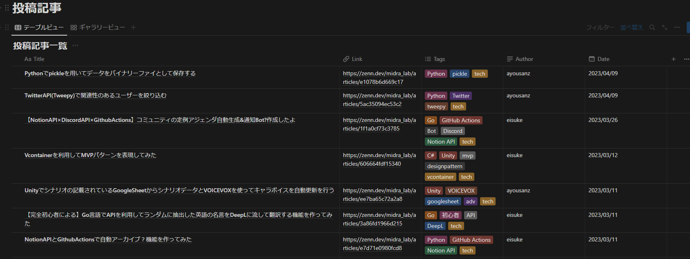

# zenn-article-aggregator
A tool to retrieve the titles, links, and authors of articles posted to Zenn's Publication and aggregate them into Notion's DB.

[日本語ドキュメント](README_JP.md)

<!-- START doctoc generated TOC please keep comment here to allow auto update -->
<!-- DON'T EDIT THIS SECTION, INSTEAD RE-RUN doctoc TO UPDATE -->

<!-- END doctoc generated TOC please keep comment here to allow auto update -->

# Demo

The data acquired at [MidraLab HP](https://midra-lab.notion.site/MidraLab-dd08b86fba4e4041a14e09a1d36f36ae) is reflected in the following image.

# Setup
1. obtain the NotionAPI token and the Id of the Notion DB you wish to reflect
2. set the NotionAPI token to the environment variable of GitHub Actions
Fork Repository and change `publication_url` in `main.py` to your Publication's URL